<h1>HONO - haggle the world</h1>

# Introduction
It makes me *"sick"* and *"sad"* when I come to an online sales site and I find an excellent product, but which I think is a little too expensive and completely unable to offer the seller a discount on it, here it is the most big problems of all online sales sites, no interaction, inert interfaces that do not benefit either the customer or the seller, or, he himself can agree to sell his product with a percentage of reduction, Hono is therefore to resound this great interaction problem that is missing at all ecommerce sites in the world by allowing the customer to offer the price that fits best and thus exchange with the seller.

### *The important thing, you need to know here is that, with this button, you will INCREASE your traffic, because, more customer will try their chance and can propose you a suitable amount for you too as the seller.*
<hr>

## How it work?
Hono connects the Customer who wants to offer a price that is affordable for a product and the seller in two steps, first, it verifies that the margin of reduction of the seller card with what the customer proposes then, send the information of the customer to the seller and the price the customer wants for the product in question, all of which is done using a number of html attributes
<hr>

## How to use it:
```html
<!DOCTYPE html>
<html>
<head>
	<title>Your Product page</title>

	<!-- Include the Hono's CSS file -->
	<link rel="stylesheet" type="text/css" href="https://raw.githubusercontent.com/Sanix-Darker/Hono/master/assets/css/hono.css">

</head>
	<body>
		
		...................
		<button>Add to Cart Button</button>
		...................

		<!-- Include the Hono Button (Most Important) Configurations -->
		<!-- data-emailseller : Seller's Email / L'email du vendeur -->
		<!-- data-product-title : Product's Title / Le nom/titre du produit/article -->
		<!-- data-product-currency : Product's currency / La monaie du produit -->
		<!-- data-product-amount : Product's amount / Le prix du produit -->
		<!-- data-product-margin-amount : Amount's margin of the product / La marge ou le pourcentage de reduction en % -->
		<!-- data-emailseller : Seller's Email / L'email du vendeur -->
		
		<span id="div_hono" data-emailseller = "test@gmail.com"
					data-product-title ="Wolfpack Jacket - Black"
					data-product-currency ="USD" 
					data-product-amount ="1,599.95"
					data-product-margin-amount ="20" 
					></span>

		...

		<!-- Include the Hono's JS script -->
		<script type="text/javascript" src="https://raw.githubusercontent.com/Sanix-Darker/Hono/master/assets/js/hono.js"></script>
		<!-- And it's ALL -->

	</body>
</html>
```
<hr>

## Hono's Button Preconfigurations Classes

#### Fade Style (Without animation on Hover)
```css 
/*
* Hono Styles buttons
* You just have to add classes in the attribute: "data-button-class"
*
* // Fade Style
* Example: data-button-class = "honobtnFade honobtnBlueGreen"
* Available colors: honobtnBlueGreen honobtnLightBlue honobtnOrange honobtnPurple
```
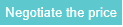 &nbsp; 
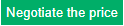 &nbsp; 
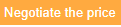 &nbsp; 
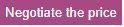<br>

#### Push Style *(With animation on Hover)*
```css
/*
* // Push Style
* Example: data-button-class = "honobtnPush honobtnBlueGreen"
* Available colors: honobtnBlueGreen honobtnLightBlue honobtnOrange honobtnPurple
```
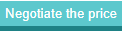 &nbsp; 
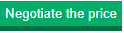 &nbsp; 
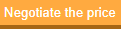 &nbsp; 
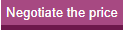<br>

#### Border Style *(With animation on Hover)*
```css
/*
* // Border Style
* Example: data-button-class = "honobtnBorder honobtnBlueGreen"
* Available colors: honobtnBlueGreen honobtnLightBlue honobtnOrange honobtnPurple
```
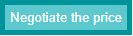 &nbsp; 
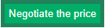 &nbsp; 
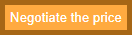 &nbsp; 
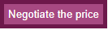<br>
<hr>

## Hono's Modal personnalizations
```css 
/**
* ----------------------------------------------
* You can personnalize the elements in the Modal
* Allready Present in the hono.css, you just have to configure them
* ----------------------------------------------
*/

/* The Price/Amount input's Style */
#hono_modal #myprice{
	/* Your style here */
}

/* The Title's style of the modal*/
#hono_modal #hono_prix_box h3{
	/* Your style here */
}

/* The Currency Style */
#hono_modal span#currency{
	/* Your style here */
}

/*The Next Step button's style */
#hono_modal #hono_suivant{
	/* Your style here */
}

/*The Send button's style */
#hono_modal #hono_envoyer{
	/* Your style here */
}

/*The Phone number input's style */
#hono_modal #hono_numeroTel{
	/* Your style here */
}

/*The Email input's style */
#hono_modal #hono_Email{
	/* Your style here */
}

/*The Message Textarea's style */
#hono_modal #hono_Message{
	/* Your style here */
}
```
<hr>

## Attributes and explanations:
<table border="1">
	<tr>
		<th> <b>Required</b> </th>
		<th style="min-width:190px;"> <b>Attribute</b> </th>
		<th> <b>Description</b> </th>
		<th> <b>Type</b> </th>
	</tr>
	<tr>
		<td>yes</td>
		<td>data-emailseller</td>
		<td>This attribute contains the email of the seller, Hono will use it to send the mail.</td>
		<td>String</td>
	</tr>
	<tr>
		<td>no</td>
		<td>data-product-image</td>
		<td>This attribute contains the path of th image(The absolute path)</td>
		<td>String</td>
	</tr>
	<tr>
		<td>yes</td>
		<td>data-product-title</td>
		<td>This attibute contains the title of the product</td>
		<td>String</td>
	</tr>
	<tr>
		<td>yes</td>
		<td>data-product-currency</td>
		<td>This attribute contains the currency of the product</td>
		<td>String</td>
	</tr>
	<tr>
		<td>yes</td>
		<td>data-product-amount</td>
		<td>This attribute contains the amount/price of the product</td>
		<td>Float</td>
	</tr>
	<tr>
		<td>yes</td>
		<td>data-product-margin-amount</td>
		<td>This attribute contain the reduction marge to apply on the amount, it's what Hono will use to control if what the customer enter is in the acceptable marge of the amount that the seller want</td>
		<td>Float</td>
	</tr>
	<tr>
		<td>no</td>
		<td>data-button-lang</td>
		<td>This attribute control all the language of the Hono systeme, now it's can work with: en, fr, sp, ge</td>
		<td>String</td>
	</tr>
	<tr>
		<td>no</td>
		<td>data-number-trying</td>
		<td>This attibute is the limit number that is allow to a customer to hit his amount proposition in the modal</td>
		<td>Int</td>
	</tr>
	<tr>
		<td>no</td>
		<td>data-autoload-action</td>
		<td>This attribute control the way the button will appear <br>-'onclosepage' [The button will appear if the customer try to close the page and cancel it in the end],
		<br>-'onclick' [This is the default value],
		<br>-'onCallBack' [The button will appear by calling the function 'honolaunch()' ],
		<br>-'onwait-10' [This value is to configure a timeout before the button appear])</td>
		<td>String</td>
	</tr>
	<tr>
		<td>no</td>
		<td>data-button-position</td>
		<td>this attribute set the button position we have (standard, float-left and float-right)</td>
		<td>String</td>
	</tr>
	<tr>
		<td>no</td>
		<td>data-button-css</td>
		<td>If you have a personnal style you want to add on Hono Button this attribute is for you</td>
		<td>String</td>
	</tr>
	<tr>
		<td>no</td>
		<td>data-button-class</td>
		<td>If you have a personnal class you want to add on Hono Button this attribute is for you</td>
		<td>String</td>
	</tr>
</table>
<hr>

### Responsive render
<table style="width: 100%;">
	<tr>
		<td>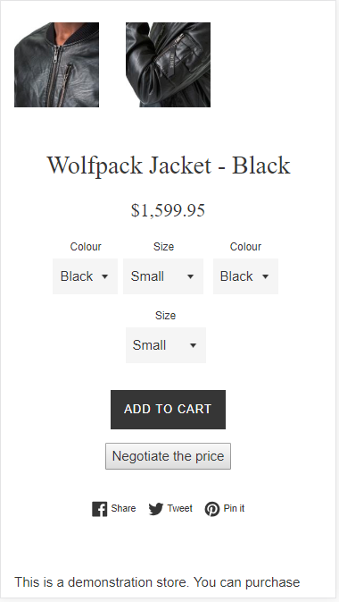</td>
		<td>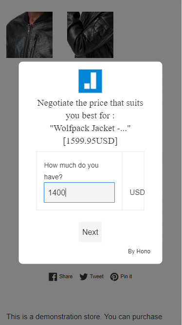</td>
		<td>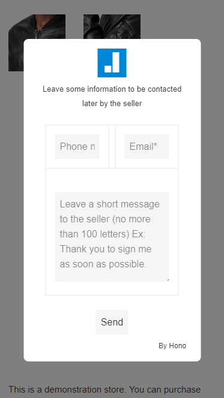</td>
		<td>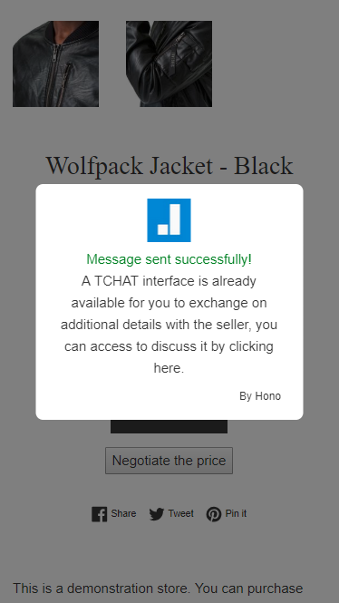</td>
		<td>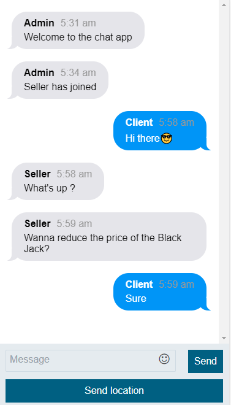</td>
	</tr>
</table>
<hr>

### How it's work with the Customer haggling his amount and the email received by the Seller:
You can Try the <a href="https://sanix-darker.github.io/Hono/">DEMO HERE</a>, *But you need to change the emailseller attribute to receive the mail as the seller.*
<table style="width: 100%;">
	<tr><td><br>Customer's Test<br></td></tr>
	<tr>
		<td colspan="2">
			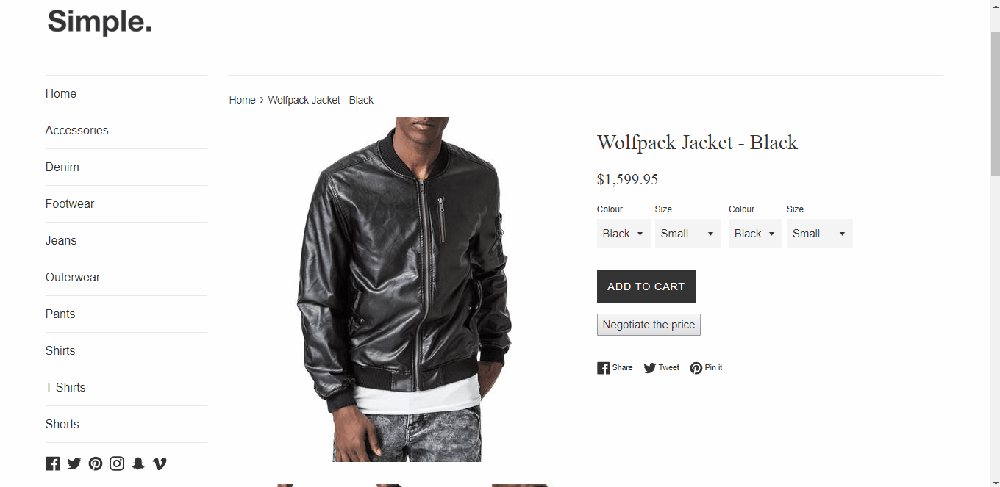
		</td>
	</tr>
	<tr><td><br>Inbox's Email of the Seller, _*LOOK AT YOUR SPAM TOO*_ <br></td></tr>
	<tr>
		<td colspan="2">
			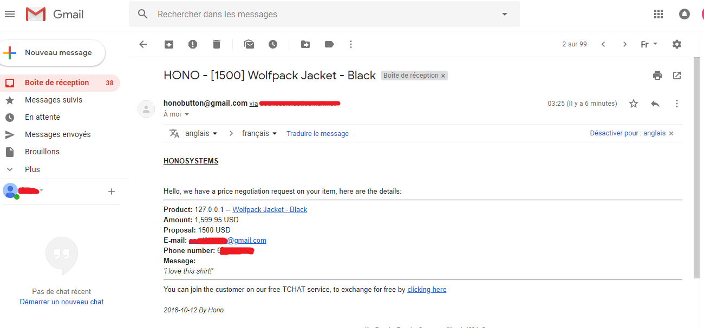
		</td>
	</tr>
	<tr><td><br>Hono's TCHAT platform<br></td></tr>
	<tr>
		<td colspan="2">
			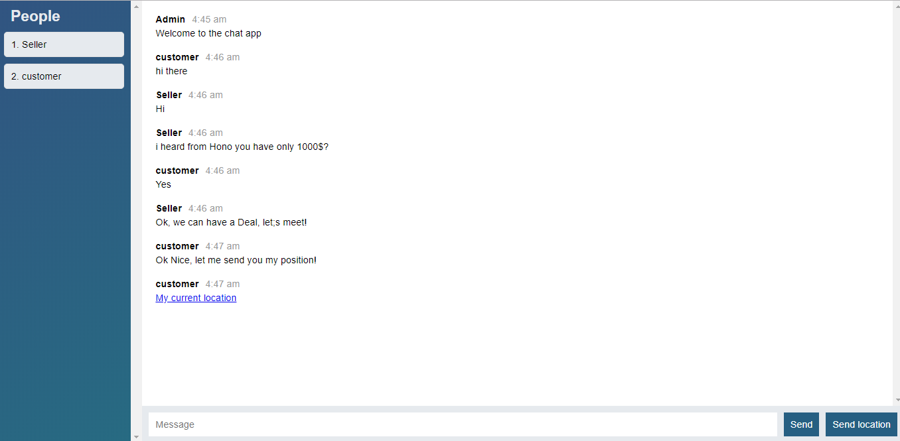
		</td>
	</tr>
</table>
<hr>

### Author:
<a href="https://github.com/Sanix-Darker"> 🐼 Sanix Darker </a>
<hr>

### SOURCES:

- <a href="https://sanix-darker.github.io/Hono/docs/">DOCUMENTATION</a><br>
- <a href="https://github.com/Sanix-Darker">SOURCE CODE</a><br>
- <a href="https://sanix-darker.github.io/Hono/">DEMO HERE</a>

### TODO:

- Adding a config file for smtp server for sending mail (assets/js/hono.js At line [434 - 436] ).
- Adding an SMS services same as mail to notify better users.

### LICENSE:

[MIT License](https://github.com/Sanix-Darker/hono/blob/master/LICENSE)